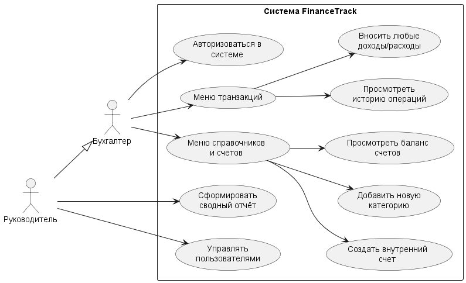
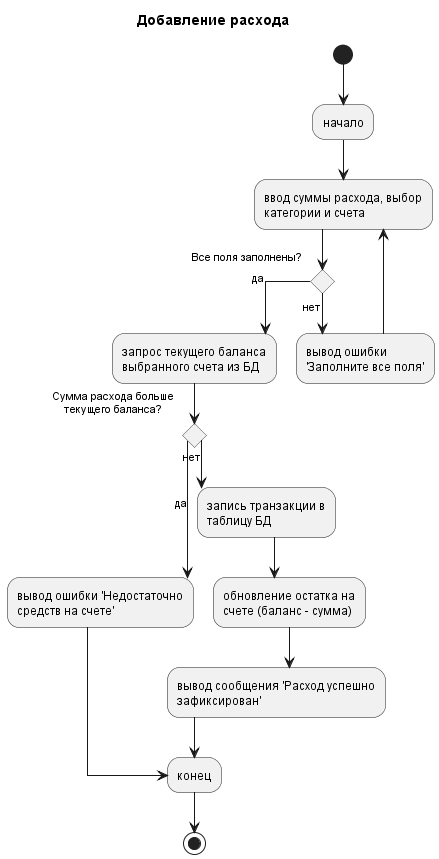
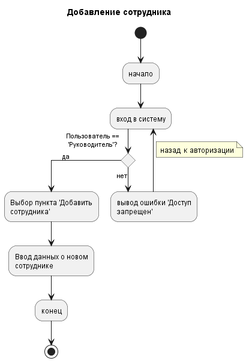

# FinanceTrack — Система учета корпоративных финансов

## Цель проекта
Обеспечение точного контроля остатков денежных средств компании, своевременное выявление наиболее затратных статей расходов и проведение комплексной оценки чистой прибыли для оптимизации бизнес-процессов.

## Роли в системе и права доступа

### 1. Руководитель
*Имеет полный административный доступ к управлению структурой организации и аналитике.*
* **Управление персоналом:** Добавление новых сотрудников в систему и удаление уволенных.
* **Аналитика:** Просмотр сводной отчетности по всем доходам и расходам компании за любые периоды.

### 2. Бухгалтер
*Отвечает за операционный учет и ежедневное внесение финансовых данных.*
* **Внесение расходов:** Регистрация любых трат компании с обязательным указанием суммы и категории.
* **Учет доходов:** Фиксация поступающих денежных средств на счета организации.
* **Ограничение:** Не имеет доступа к изменению списка сотрудников и их окладов.

## Диаграмма функций сотрудников (Use Case)

## Принцип некоторых функций

